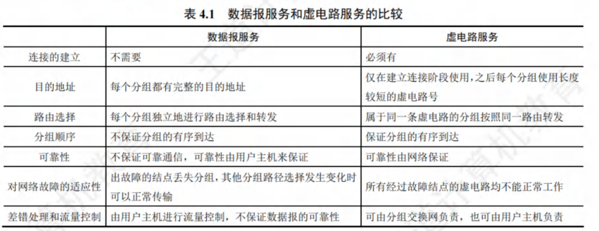
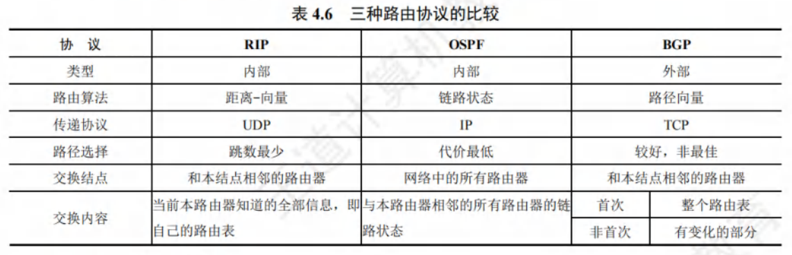
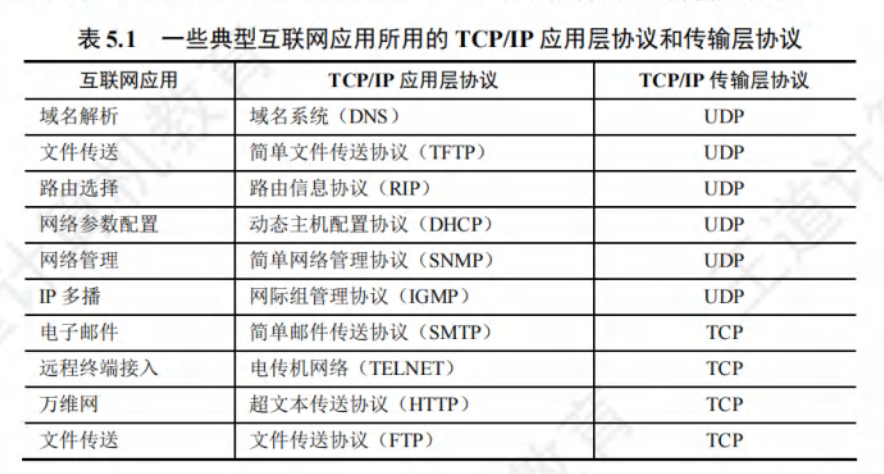
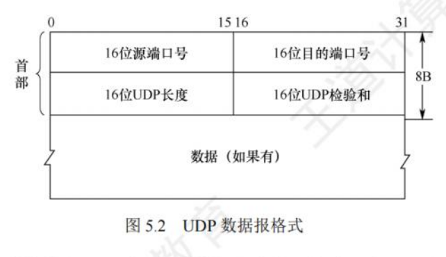

# 计算机网络复习大纲

## 计算机网络中各层的功能、协议与定理

### 物理层

#### 物理层的功能

#### 奈奎斯特定理

在**理想低通**信道中，极限码元传输速率为$2W$波特，其中$W$是信号的频率带宽（单位为Hz）。若用$V$表示每个码元的离散点评数量，则极限数据率为
$$
理想低通信道下的极限数据传输速率=2Wlog_2V(单位为b/s)
$$

#### 香农定理

香农定理给出了**带宽受限且有高斯噪声干扰的信道**的极限数据传输速率，当用该速率传输数据时，不会产生误差，即
$$
信道的极限数据传输速率=Wlog_2(1+{s \over N})(单位为b/s)
$$
其中，$W$为信道的频率带宽（单位为Hz），$S$为信道内所传输信号的平均功率，$N$为信道内的高斯噪声功率。$S \over N$是信噪比，$信噪比=10log_{10}({S \over N})$

### 数据链路层

#### 数据链路层的功能

- **为网络层进行服务**。可以提供三种服务：
  - 无确认的无连接服务。
  - 有确认的无连接服务。
  - 有确认的面向连接的服务。
- **链路管理**。
- **封装成帧与透明传输**。封装成帧指的是在一段数据的**前后**分别添加首部和尾部构成帧。
- **流量控制**。对数据链路层来说，流量控制的是**相邻节点**之间的数据链路上的流量，而对传输层来说，控制的是**从源端到目的端**之间的流量。
- **差错检测。**错误分为帧错和位错。

#### 单帧滑动窗口与停止-等待协议（S-W）

对于停止-等待协议，因为每发送一个数据帧就停止并等待，所以用1比特来编号就已足够。发送的帧交替地用0和1来标识,确认帧分别用 ACK0和 ACK1来表示，当收到的确认帧有误时，就重传已发送的数据帧。若连续出现相同序号的数据帧，则表明发送方进行了超时重传。若连续出现相同序号的确认帧，则表明接收方收到了重复帧。

#### 多帧滑动窗口与后退N帧协议（GBN）

**接收方只允许按顺序接受帧**。如果出现差错，需要全部重传。

#### 多帧滑动窗口与选择重传协议（SR）

设法只重传出现差错和计时器超时的数据帧，先收下失序但是正确到达且序号仍落在接收窗口内的那些数据帧，等到所缺序号的数据帧收齐后，再一并交到上层。

一旦接收方检测到哪个数据帧出错，就向发送方发送一个否定帧$NAK$，要求发送方立即重传$NAK$指定的数据帧。

SR协议需要满足：

1. $W_R+W_T \leqslant 2^n$
2. $w_R \leqslant W_T$

#### ALOHA协议

##### 纯ALOHA协议

纯ALOHA协议的基本思想是，当总线形网络中的任何站点需要发送数据时，可以不进行任何检测就发送数据。若在一段时间内未收到确认，则该站点就认为传输过程中发生了冲突。发送站点需要等待一段时间后再发送数据，直至发送成功。

##### 时隙ALOHA协议

时隙ALOHA协议同步各站点的时间，将时间划分为一段段等长的时隙（SIot），规定站点只能在每个时隙开始时才能发送帧，发送一帧的时间必须小于或等于时隙的长度。这样做避免了用户发送数据的随意性，降低了产生冲突的可能性，提高了信道的利用率。

#### CSMA协议

载波监听多路访问控制（Carrier Sense Multiple Aceess，CSMA），分为三种：

- 1-坚持CSMA
    1-坚持CSMA的基本思想是：当站点要发送数据时首先监听信道；若信道空闲，则立即发送数据：若信道忙，则继续监听直至信道空闲。“坚持”的含义是监听到信道忙时，继续坚持监听信道；“1”的含义是监听到信道空闲时，立即发送帧的概率为1。
- 非检查CSMA
    非坚持CSMA的基本思想是：当站点要发送数据时，首先监听信道：若信道空闲，则立即发送数据：若信道忙，则放弃监听，等待一个随机的时间后，再重新监听。
- p-坚持CSMA
    p-坚持CSMA只适用于时分信道，其基本思想是：当站点要发送数据时，首先监听信道；若信道忙，则持续监听（即等到下一个时隙再监听），直至信道空闲；若信道空闲，则以概率$p$发送数据，以概率$1- P$推迟到下一个时隙再继续监听：直到数据发送成功。

#### CSMA/CD协议

载波监听多路访问/冲突检测（CSMA/CD）协议适用于**总线型网络或半双工网络环境。**

载波监听是指每个站点在发送前和发送过程中都必须不停地检测信道，在发送前检测信道是为了获得发送权，在发送过程中检测信道是为了及时发现发送的数据是否发生冲突。站点要在发送数据前先监听信道，只有信道空闲时才能发送。冲突检测（Collision Detection）就是边发送边监听的，若监听到了冲突，则立即停止数据发送，等待一段随机时间后，重新开始尝试发送数据。CSMA/CD的工作流程可简单地概括为“先听后发，边听边发，冲突停发，随机重发”。

##### 最短帧长的计算方法

$$最短帧长=总线传播时延 \times 数据传输速率 \times 2$$

**一个非常重要的例子**：

以太网规定51.2μs为争用期的长度。对于10Mb/s的以太网，在争用期内可发送512bit，即64B。当以太网发送数据时，若前64B未发生冲突，则后续数据也不会发生冲突（表示已成功抢占信道）。换句话说，若发生冲突，则一定在前64B。因为一旦检测到冲突就立即停止发送，所以这时发送出去的数据一定小于64B。于是，以太网规定最短帧长为64B，凡长度小于64B的帧，就都是因为冲突而异常中止的无效帧，收到这种无效帧时应立即丢弃。若只发送小于64B的帧，如40B的帧，则需要在MAC子层中于数据字段的后面加一个整数字节的填充字段，以保证以太网的MAC帧的长度不小于64B。

##### 二进制指数退避算法

算法精髓：

1) 确定基本退避时间，一般取 2 倍的总线端到端的传播时延 $2\tau$(即争用期)。
2) 从离散的整数集合$[0,1,…,(2^k-1)]$中随机取出一个数，记为r，重传所需推迟的时间就是r倍的争用期，即 $2r\tau$。参数 $k=min[重传次数,10]$，可见当重传次数不超过 10 时，参数 k等于重传次数;但当重传次数超过 10 时，k就不再增大，而一直等于 10。
3) 当重传达 16 次仍不成功时，说明网络太拥挤，认为该帧永远无法正确发出，抛弃该帧并向高层报告出错(这个条件也容易忽略，请读者注意)。

#### CSMA/CA协议

**CSMA/CD协议**用于**有线连接的局域网**，而**CSMA/CA协议**用于**无线局域网环境。**这里，CA指的是冲突避免（Collision Avoidance, CA）。算法归纳如下：

1) 若站点最初有数据要发送（而非发送不成功再进行重传），且检测到信道空闲，那么在等待时间DIFS后，就发送整个数据帧。
2) 否则，站点执行CSMA/CA退避算法，选取一个随机退避值。一旦检测到信道忙，退避计时器就保持不变。只要信道空闲，退避计时器就进行倒计时。
3) 当退避计时器减至0时（这时信道只可能是空闲的），站点就发送整个帧并等待确认。
4) 发送站若收到确认，就知道已发送的帧被目的站正确接收。这时要发送第二帧，就要从步骤2)开始，执行CSMA/CA退避算法，随机选定一段退避时间。

若发送站在规定时间（由重传计时器控制）内未收到确认帧ACK，就必须重传该帧，再次使用CSMA/CA协议争用该信道，直到收到确认，或经过若干次重传失败后放弃发送。

#### 轮询访问：令牌传递协议

在轮询访问中，用户不能随机地发送信息，而要通过一个集中控制的监控站，以循环方式轮询每个结点，再决定信道的分配。

在令牌传递协议中，一个令牌（Token）沿着环形总线在各站之间依次传递。令牌是一个特殊的控制帧，它本身并不包含信息，仅控制信道的使用，确保同一时刻只有一个站独占信道。当环上的一个站希望发送帧时，必须等待令牌。站点只有取得令牌后才能发送帧，因此令牌环网络不会发生冲突（因为令牌只有一个）。站点发送完一帧后，应释放令牌，以便让其他站使用。因为令牌在网环上是按顺序依次传递的，所以对所有入网计算机而言，访问权是公平的。令牌环网络中令牌和数据的传递过程如下：
1) 当网络空闲时，环路中只有令牌帧在循环传递。
2) 当令牌传递到有数据要发送的站点时，该站点就修改令牌中的一个标志位，并在令牌中附加自己需要传输的数据，将令牌变成一个数据帧，然后将这个数据帧发送出去。
3) 数据帧沿着环路传输，接收到的站点一边转发数据，一边查看帧的目的地址。若目的地址和自己的地址相同，则接收站就复制该数据帧，以便进一步处理。
4) 数据帧沿着环路传输，直到到达该帧的源站点，源站点收到自己发出去的帧后便不再转发。同时，通过检验返回的帧来查看数据传输过程中是否出错，若出错则重传。
5) 源站点传送完数据后，重新产生一个令牌，并传递给下一站点，交出信道控制权。

#### PPP协议

点对点协议（Point-to-Point Protocol, PPP）是现在最流行的点对点链路控制协议。PPP协议有三个组成部分：

1) 一个链路控制协议(LCP)。用来建立、配置、测试数据链路连接，以及协商一些选项。
2) 一套网络控制协议(NCP)。PPP协议允许采用多种网络层协议，每个不同的网络层协议要用一个相应的 NCP 来配置，为网络层协议建立和配置逻辑连接。
3) 一种将 IP 数据报封装到串行链路的方法。IP 数据报在 PPP 帧中就是其信息部分，这个信息部分的长度受最大传送单元(MTU)限制。

因为PPP是点对点的，并不是总线形，所以无须使用CSMA/CD协议，自然就不会有最短帧长的限制，所以信息段占0~1500字节，而不是46~1500字节。

PPP 协议的特点如下：
1) PPP不使用序号和确认机制，只保证无差错接收(CRC检验)，因此是不可靠服务。
2) PPP只支持全双工的点对点链路，不支持多点线路。
3) PPP的两端可以运行不同的网络层协议，但仍可使用同一个PPP进行通信。
4) PPP是面向字节的，所有PPP帧的长度都是整数个字节。

### 网络层

#### 网络层的功能

- 路由与转发。
- 网络层提供的两种服务：
    - 面向连接的虚电路服务。**建立一条逻辑上的虚电路，**一旦建立，就固定了**虚电路对应的物理路径。**分成虚电路建立、数据传输与虚电路释放。虚电路之所以是虚，是因为这条电路不是专用的，每个节点到其他节点之间的链路可能同时有若干条虚电路通过，也可能同时在多个节点之间建立虚电路。
    - 无连接的数据报服务。

- SDN提供的服务。
- 拥塞控制。拥塞控制的方法有两种：
    - 开环控制。
    - 闭环控制。

#### ARP协议

地址解析协议（Address Resolution Protocol, ARP），完成IP地址到MAC地址的映射。每台主机都设有一个ARP高速缓存，用来存放本局域网上各主机和路由器的IP地址到MAC地址的映射表，即ARP表。使用ARP来动态维护ARP表。

ARP工作在网络层，其工作原理如下：

主机A欲向本局域网上的某台主机B发送IP数据报时，先在其ARP高速缓存中查看有无主机B的IP地址。

1) 若有，则可以查出其对应的硬件地址，再将此硬件地址写入MAC帧，然后通过局域网将该MAC帧发往此硬件地址。
2) 若没有，则通过使用**目的MAC地址为FF-FF-FF- FF-FF-FF**的帧来封装并**广播ARP请求分组**（广播发送），使同一个局域网里的所有主机都收到此ARP请求。主机B收到该ARP请求后，向主机A发出ARP响应分组（单播发送），分组中包含主机B的IP地址与MAC地址的映射关系，主机A收到ARP响应分组后就将此映射写入ARP缓存，然后按查询到的硬件地址发送MAC帧。ARP因为“看到了”IP地址，所以它工作在网络层，而NAT路由器因为“看到了”端口，所以它工作在传输层。对于某个协议工作在哪个层次，读者应该能通过协议的工作原理进行推测。

#### DHCP协议

动态主机配置协议（Dynamic Host Configuration Protocol, DHCP）常用于给主机动态地分配IP地址，它提供了即插即用地联网机制。**DHCP是应用层协议，它是基于UDP的。**

DHCP服务器和DHCP客户的交换过程如下：
1) DHCP客户广播 **“DHCP发现”** 消息，试图找到网络中的DHCP服务器，以便从DHCP服务器获得一个IP地址。源地址为0.0.0.0，目的地址为255.255.255.255。
2) DHCP服务器收到“DHCP发现”消息后，广播 **“DHCP提供”** 消息，其中包括提供给DHCP客户机的IP地址。源地址为DHCP服务器地址，目的地址为255.255.255.255。
3) DHCP客户收到“DHCP提供”消息，若接受该IP地址，则广播 **“DHCP请求”** 消息向DHCP服务器请求提供IP地址。源地址为0.0.0.0，目的地址为255.255.255.255。
4) DHCP服务器广播 **“DHCP确认”** 消息，将IP地址分配给DHCP客户。源地址为DHCP服务器地址，目的地址为255.255.255.255。

#### ICMP协议

网际控制报文协议（Internet Control Message Protocol, ICMP），让主机或路由器报告差错和异常情况。ICMP报文被封装在IP数据包中发送，是网络层协议。

ICMP差错报告报文用于目标主机或到目标主机路径上的路由器，向源主机报告差错和异常情况。共有以下5种常用的类型：
1) 终点不可达。当路由器或主机不能交付数据报时，就向源点发送终点不可达报文。
2) 源点抑制。当路由器或主机因为拥塞而丢弃数据报时，就向源点发送源点抑制报文，使源点知道应当把数报的发送速率放慢。
3) 时间超过。当路由器收到生存时间（TTL）为零的数据报时，除丢弃该数据报外，还要向源点发送时间超过报文。当终点在预先规定的时间内不能收到一个数据报的全部数据报片时，就把已收到的数据报片都丢弃，并向源点发送时间超过报文。
4) 参数问题。当路由器或目的主机收到的数据报的首部中有的字段的值不正确时，就丢弃该数据报，并向源点发送参数问题报文。
5) 改变路由（重定向）。路由器把改变路由报文发送给主机，让主机知道下次应将数据报发送给另外的路由器（可通过更好的路由）。

#### 分层次的路由选择协议

- 内部网关协议（Interior Gateway Protocol, IGP）
- 外部网关协调（External Gateway Protocol, EGP）

#### RIP协议

路由信息协议（Routing Information Protocol, RIP）是内部网关协议IGP中最先得到广泛应用的协议。**RIP是一种分布式的基于距离向量的路由选择协议。RIP是应用层协议，使用UDP传送数据（端口520）.**

**RIP协议好消息传播得快，坏消息传播得慢。**

#### OSPF协议

开放最短路径优先（OSPF）协议是使用分布式链路状态路由算法的典型代表，其与RIP协议的主要区别如下：

1) OSPF向本自治系统中所有路由器发送信息。这里使用的方法是洪泛法。而RIP仅仅向自己相邻的几个路由器发送信息。
2) 发送的信息是与本路由器相邻的所有路由器的链路状态，但这只是路由器所知道的部分信息。而在RIP中，发送的信息是本路由器所知道的全部信息，即整个路由表。
3) 只有当链路状态发生变化时，路由器才用**洪泛法**向所有路由器发送此信息，并且更新过程收敛得快，不会出现RIP“坏消息传得慢”的问题。而在RIP中，不管网络拓扑是否发生变化，路由器之间都要定期交换路由表的信息。
4) **OSPF是网络层协议**，它不用UDP或TCP，而直接用IP数据报传送（其IP数据报首部的协议字段为89）。而RIP是应用层协议，它在传输层使用UDP。

#### BGP协议

边界网关协议（Border Gateway Protocol, BGP）是不同自治系统AS的路由器之间交换路由信息的协议，是一种外部网关协议。

三种协议的比较：

#### IGMP协议

网际组管理协议（Internet Group Management Protocol, IGMP）可以让路由器获得多播组的成员的信息。

IGMP是让连接到本地局域网上的多播路由器，知道本局域网上是否有主机参加或退出了某个多播组。IGMP并不是在互联网范围内对所有多播组成员进行管理的协议。IGMP不知道IP多播组包含的成员数，也不知道这些成员分布在哪些网络上。

IGMP报文被封装在IP数据报中传送，但它也向IP提供服务。因此不把IGMP视为一个单独的协议，而视为整个网际协议IP的一个组成部分。IGMP的工作可分为两个阶段。

**第一阶段**：当某台主机加入新的多播组时，该主机应向多播组的多播地址发送一个IGMP报文，声明自己要成为该组的成员。本地的多播路由器收到IGMP报文后，还要利用多播路由选择协议，把这种组成员关系转发给互联网上的其他多播路由器。

**第二阶段**：组成员关系是动态的。本地多播路由器要周期性地探询本地局域网上的主机，以便知道这些主机是否仍继续是组的成员。只要对某个组有一台主机响应，多播路由器就认为这个组是活跃的。但一个组在经过几次探询后仍然没有一台主机响应，多播路由器就认为本网络上的主机都已离开了这个组，因此就不再把这个组的成员关系转发给其他的多播路由器。

### 传输层

#### 传输层的功能

- 应用进程之间的逻辑通信。应用进程之间的通信又称**端到端的逻辑通信。**
- 复用和分用。
- 差错检测。传输层要对收到的报文（首部和数据部分）进行差错检测。对于TCP协议，若接收方发现报文段出错，则要求发送方重发该报文段。对于UDP协议，若接收方发现数据报出错，则直接丢弃。在网络层，IP数据报首部中的检验和字段只检验首部是否出错，而不检查数据部分。
- 提供面向连接和无连接的传输协议。传输层向高层用户屏蔽了低层网络核心的细节（如网络拓扑、路由协议等），它使应用进程看见的是在两个传输层实体之间好像有一条端到端的逻辑通信信道，这条逻辑通信信道对上层的表现却因传输层协议不同而有很大的差别。当传输层采用面向连接的TCP协议时，尽管下面的网络是不可靠的（只提供尽最大努力的服务），但这种逻辑通信信道就相当于一条全双工的可靠信道。但当传输层采用无连接的UDP协议时，这种逻辑通信信道仍然是一条不可靠信道。

一些典型互联网应用所用的TCP/IP应用层协议和传输层协议：

#### UDP协议

##### UDP协议的特点

1) UDP无须建立连接。因此UDP不会引入建立连接的时延。试想若DNS运行在TCP而非UDP上，则DNS的速度会慢很多。HTTP使用TCP而非UDP，是因为对于基于文本数据的Web网页来说，可靠性是至关重要的。
2) 无连接状态。TCP需要在端系统中维护连接状态。此连接状态包括接收和发送缓存、拥塞控制参数和序号与确认号的参数。而UDP既不维护连接状态，也不跟踪这些参数。因此，当某些专用服务器使用UDP时，一般都能支持更多的活动客户机。
3) UDP的首部开销小。**TCP有20B的首部开销，而UDP仅有8B的开销。**
4) UDP没有拥塞控制，因此网络中的拥塞不会影响源主机的发送速率。某些实时应用要求源主机以稳定的速率发送数据，能容忍一些数据的丢失，但不允许有太大的时延。
5) UDP支持**一对一、一对多、多对一和多对多的交互通信。**

注意：UDP不保证可靠交付，但这并不意味着应用对数据的要求是不可靠的，所有维护可靠性的工作可由用户在应用层来完成。应用开发者可根据应用的需求来灵活设计自己的可靠性机制。

##### UDP数据报格式

##### UDP检验

在计算检验和时，要在UDP数据报之前增加12B的伪首部，伪首部并不是UDP的真正首部。只是在计算检验和时，临时添加在UDP数据报的前面，得到一个临时的UDP数据报。检验和就是按照这个临时的UDP数据报来计算的。伪首部既不向下传送又不向上递交，而只是为了计算检验和。

UDP计算检验和的方法和计算IP数据报首部检验和的方法相似。不同的是：IP数据报的检验和只检验IP数据报的首部，但UDP的检验和要将首部和数据部分一起检验。

UDP计算检验和的方法：

1. 发送方首先把全O放入检验和字段并添加伪首部，然后把UDP数据报视为许多16位的字串接起来。若UDP数据报的数据部分不是偶数个字节，则要在末尾填入一个全0字节（但此字节不发送）。
2. 然后按二进制反码计算出这些16位字的和，将此和的二进制反码写入检验和字段，并发送。
3. 接收方把收到的UDP数据报加上伪首部（若不为偶数个字节，则还需要补上全0字节）后，按二进制反码求这些16位字的和。
4. 当无差错时其结果应为全1，否则就表明有差错出现，接收方就应该丢弃这个UDP数据报。

#### TCP协议

TCP协议主要解决传输的可靠、有序、无丢失和不重复问题，其特点如下：

1) TCP是面向连接的传输层协议，TCP连接是一条逻辑连接。
2) 每一条TCP连接只能有两个端点，每一条TCP连接只能是一对一的。
3) TCP提供可靠交付的服务，保证传送的数据无差错、不丢失、不重复且有序。
4) TCP提供全双工通信，允许通信双方的应用进程在任何时候都能发送数据，为此TCP连接的两端都设有发送缓存和接收缓存，用来临时存放双向通信的数据。发送缓存用来暂时存放以下数据：
    ①发送应用程序传送给发送方TCP准备发送的数据;
    ②TCP已发送但尚未收到确认的数据。
接收缓存用来暂时存放以下数据：
    ①按序到达但尚未被接收应用程序读取的数据;
    ②不按序到达的数据。
5) TCP是面向字节流的，虽然应用程序和TCP的交互是一次一个数据块（大小不等），但TCP把应用程序交下来的数据仅视为一连串的无结构的字节流。

TCP和UDP在发送报文时所采用的方式完全不同。**UDP报文的长度由发送应用进程决定，而TCP报文的长度则根据接收方给出的窗口值和当前网络拥塞程度来决定。**